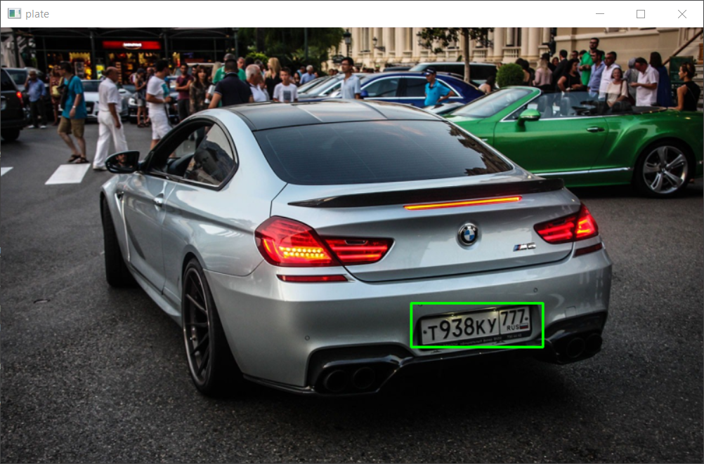
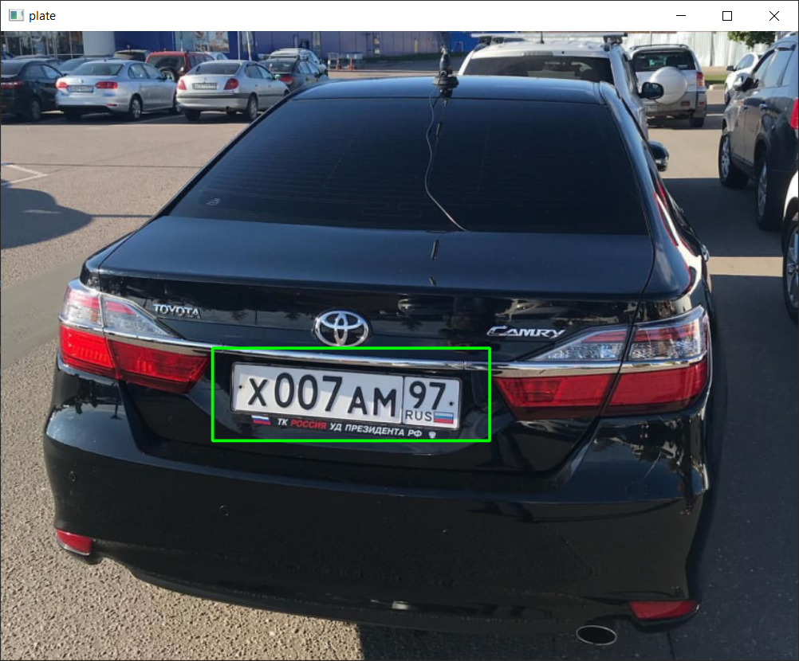
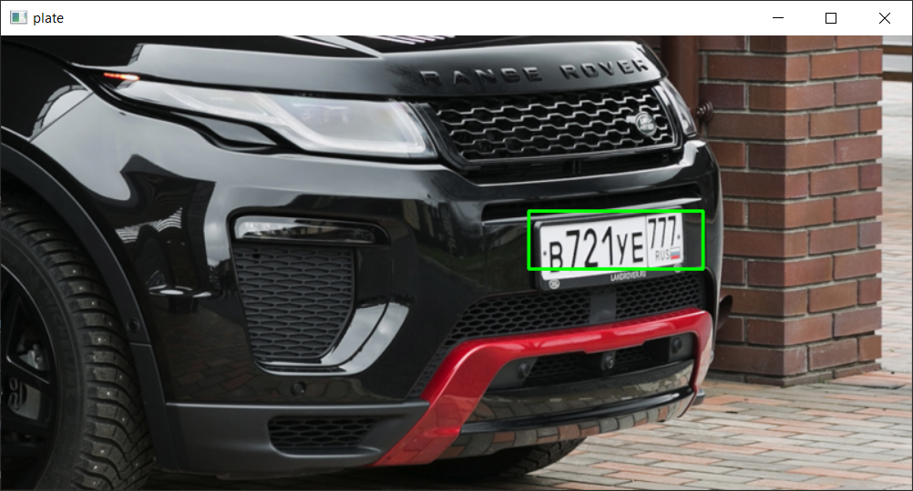
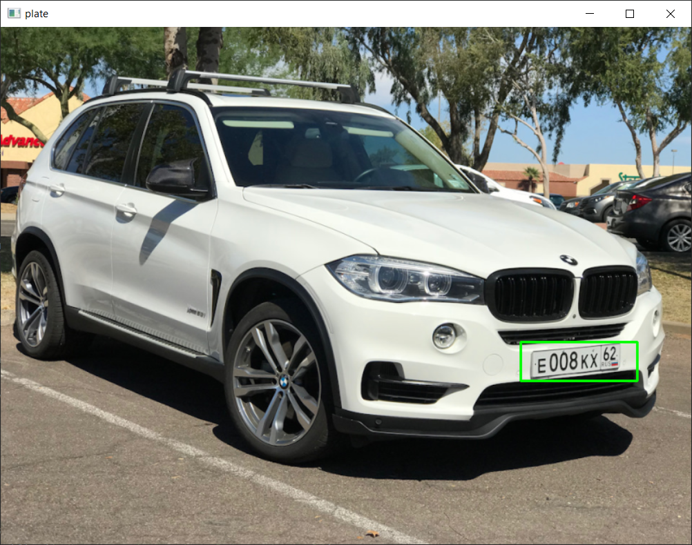
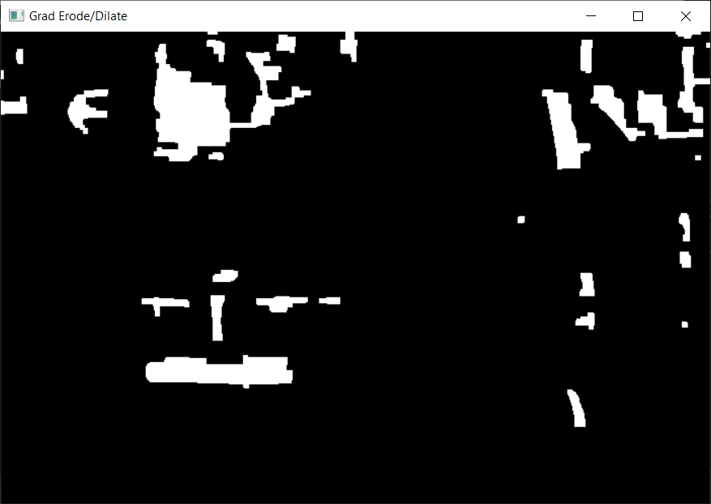

# Automatic License/Number Plate Recognition (ANPR) 

 
Предварительно полученные фильтры Хаара - _https://github.com/opencv/opencv/tree/master/data/haarcascades_

Точность определения номера = 82.1%

